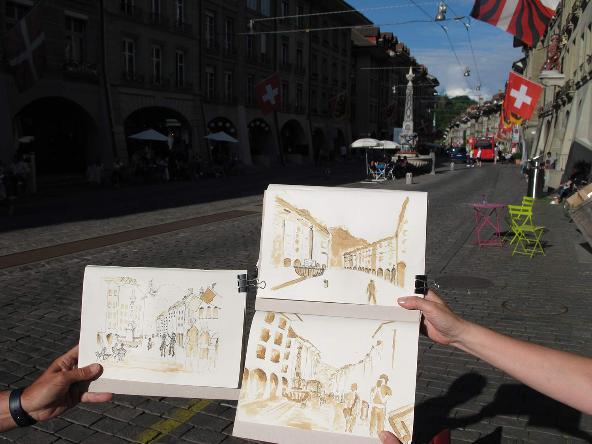
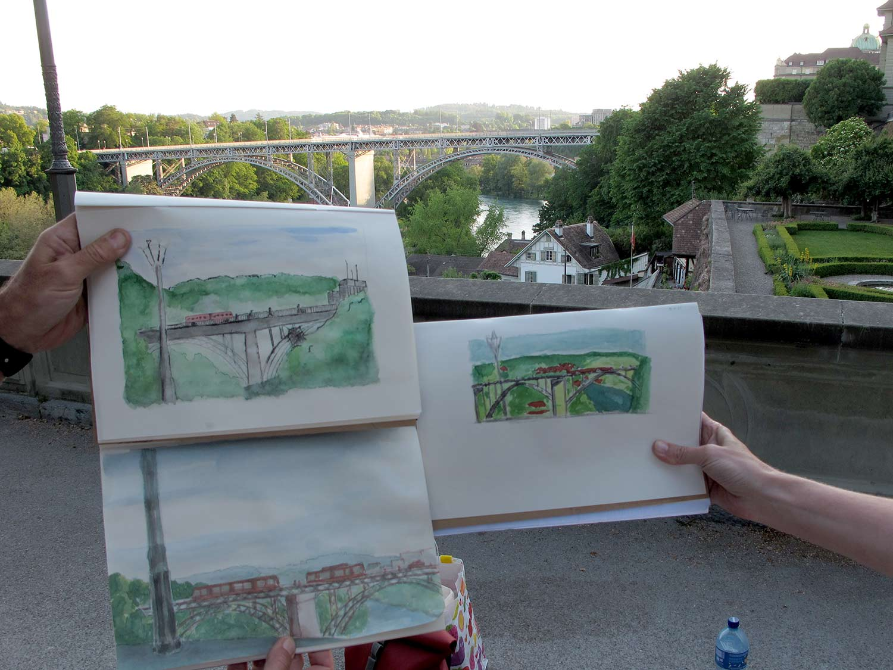
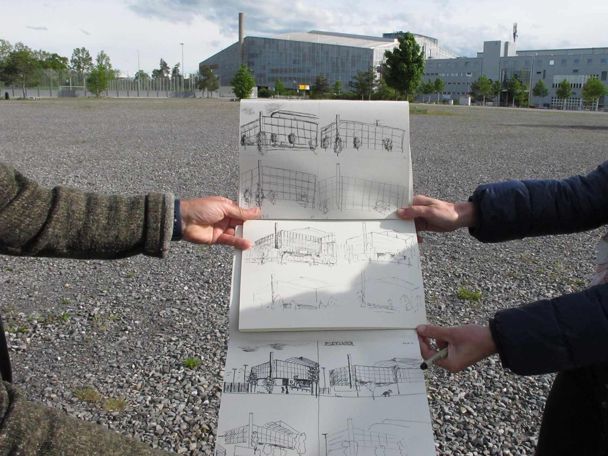

+++
title = "Urban Sketching"
date = "2021-06-04"
draft = false
pinned = false
tags = ["Weiterbildung", "Urban-Sketching", "Skizzieren"]
image = "img_5822urban_k_g.jpg"
description = "Dieser Blogeintrag gibt einen Einblick in die kürzlich durchgeführte Weiterbildung zum Thema \"Urban Sketching\"."
footnotes = ""
+++
# Weiterbildung "Urban Sketching"

An zwei Abenden im Mai und Juni 2021 fand die Weiterbildung "Urban Sketching" am bwd statt. In einer Kleingruppe haben wir an unterschiedlichen Standorten im Wankdorf und in der Berner Altstadt skizziert. Beim *Urban Sketching* steht das gemeinsame Zeichnen im urbanen Raum im Zentrum. Die entstandenen Zeichnungen bleiben nicht im Skizzenbuch versteckt, sondern werden direkt im Internet veröffentlicht. So wie dies zum Beispiel in diesem Blog der Fall ist. \
Beim *Urban Sketching* geht es darum eine urbane Szene mit ihren flüchtigen Momenten vereinfacht zeichnerisch einzufangen.

Hier ein paar Impressionen aus dem Weiterbildungskurs:

